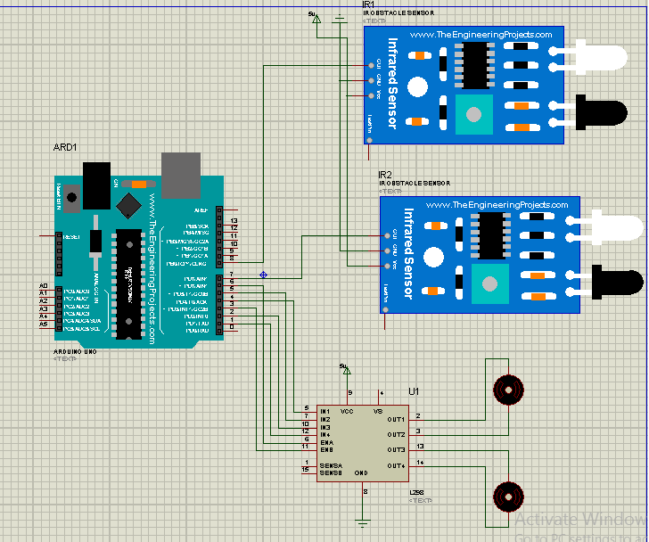

# Edge Follower Robot

An Arduino-based edge detection robot that can follow edges and avoid falling off surfaces using infrared sensors.

## Project Overview

This project implements an autonomous robot that uses two infrared sensors to detect edges and navigate along them safely. The robot is designed to move forward along a surface and when it detects an edge (or cliff), it backs up, turns, and continues forward to avoid falling.

## Circuit Diagram

## Hardware Components

- Arduino Uno (or compatible microcontroller)
- 2x DC Motors for movement
- 2x Infrared sensors (left and right)
- Motor driver module
- LED indicator
- Chassis and wheels
- Power supply

## Pin Configuration

| Component | Arduino Pin | Description |
|-----------|-------------|-------------|
| Left Motor 1 | Pin 4 | Left motor output 1 |
| Left Motor 2 | Pin 5 | Left motor output 2 |
| Right Motor 1 | Pin 2 | Right motor output 1 |
| Right Motor 2 | Pin 1 | Right motor output 2 |
| Left Sensor | Pin 8 | Left IR sensor input |
| Right Sensor | Pin 7 | Right IR sensor input |
| Motor Enable A | Pin 6 | Left motor enable |
| Motor Enable B | Pin 3 | Right motor enable |
| LED Indicator | Pin A0 | Status LED |

## How It Works

The robot uses two infrared sensors positioned at the front edges to detect the surface boundary:

1. **Normal Operation**: When both sensors detect the surface (LOW readings), the robot moves forward and the LED is off.

2. **Edge Detection**: When one or both sensors detect an edge (HIGH readings), the robot:
   - Turns on the status LED
   - Backs up for 400ms
   - Turns left or right for 550ms (depending on which sensor detected the edge)
   - Moves forward briefly for 200ms
   - Continues normal operation

## Robot Behavior

- **Both sensors LOW**: Move forward
- **Both sensors HIGH**: Back up → Turn right → Move forward
- **Left sensor HIGH, Right sensor LOW**: Back up → Turn left → Move forward  
- **Left sensor LOW, Right sensor HIGH**: Back up → Turn right → Move forward

## Setup Instructions

1. Connect the hardware components according to the circuit diagram
2. Upload the `EdgeDetecting_robot.ino` code to your Arduino
3. Place the robot on a surface with clear edges
4. Power on the robot

## Code Structure

The Arduino code includes the following functions:

- `setup()`: Initialize pin modes and stop motors
- `loop()`: Main program loop with sensor reading and decision logic
- `ForWard()`: Move robot forward
- `BackWard()`: Move robot backward
- `Left()`: Turn robot left
- `Right()`: Turn robot right
- `sTOP()`: Stop all motors

## Demo

A demo video (`Demo-video.mp4`) is included in the repository showing the robot in action.

## Safety Notes

- Always test the robot in a safe environment
- Ensure the surface is appropriate for testing edge detection
- Monitor the robot during initial testing to verify proper behavior

## License

This project is open source. Feel free to modify and improve upon the design.